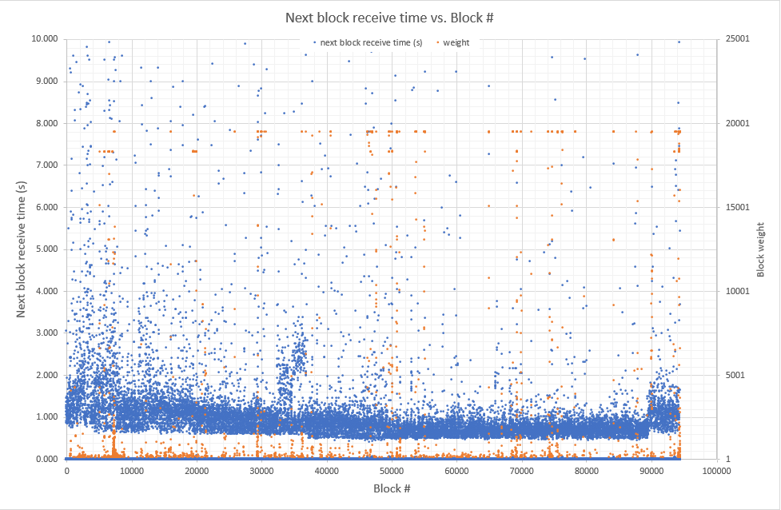
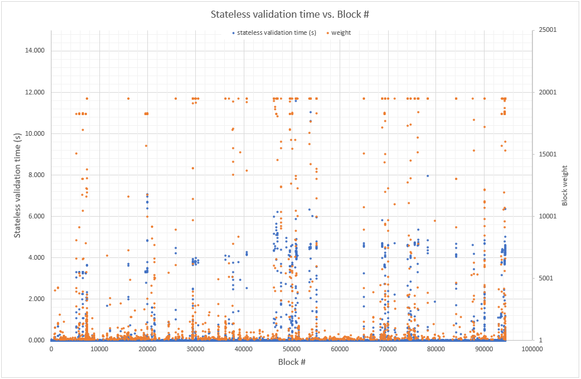
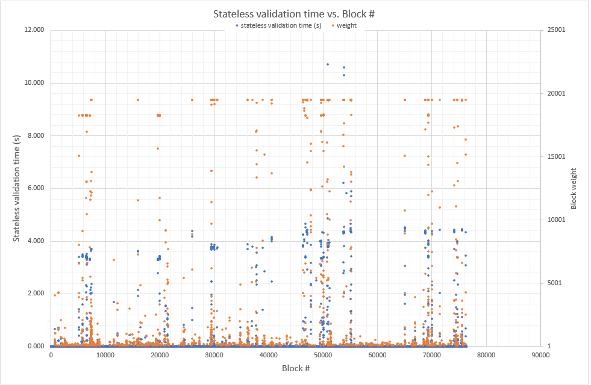
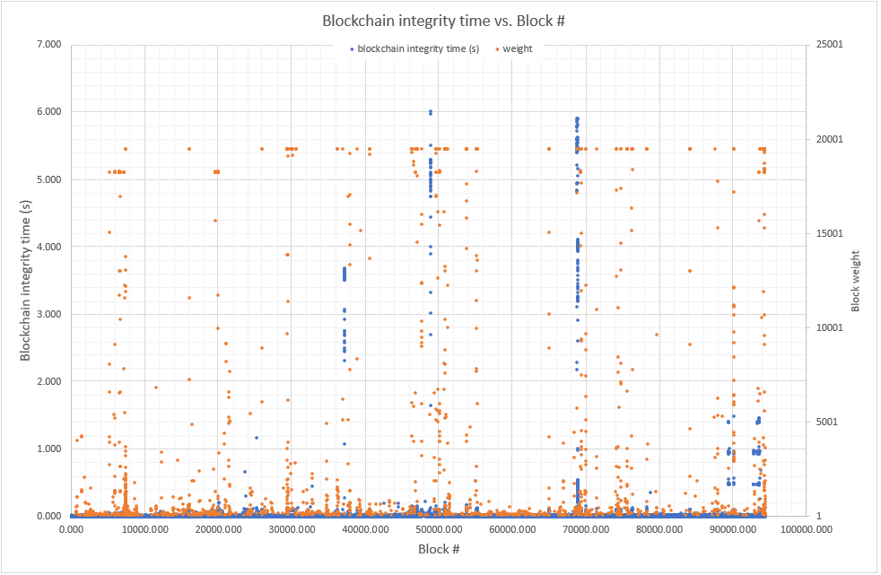
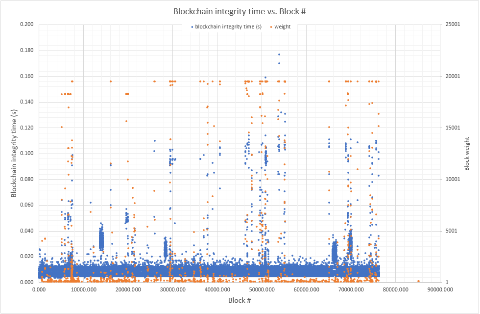
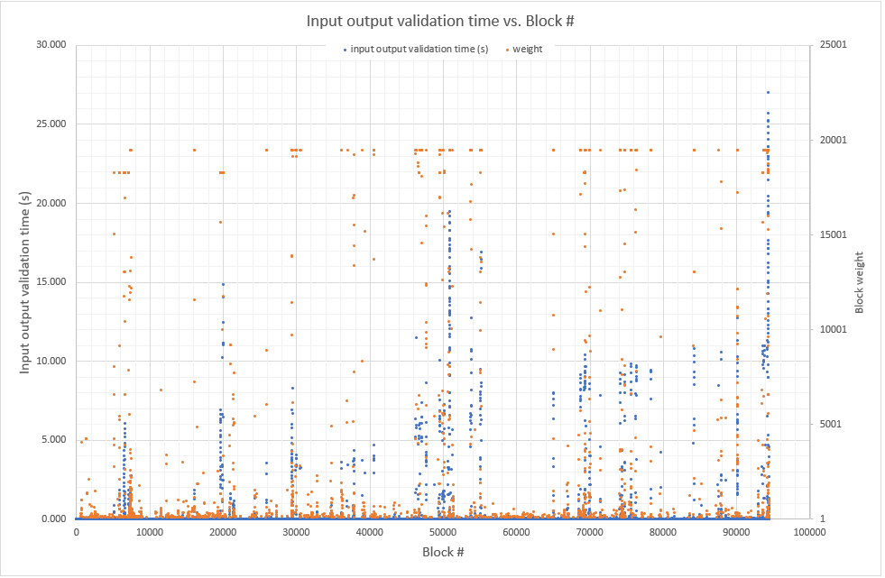
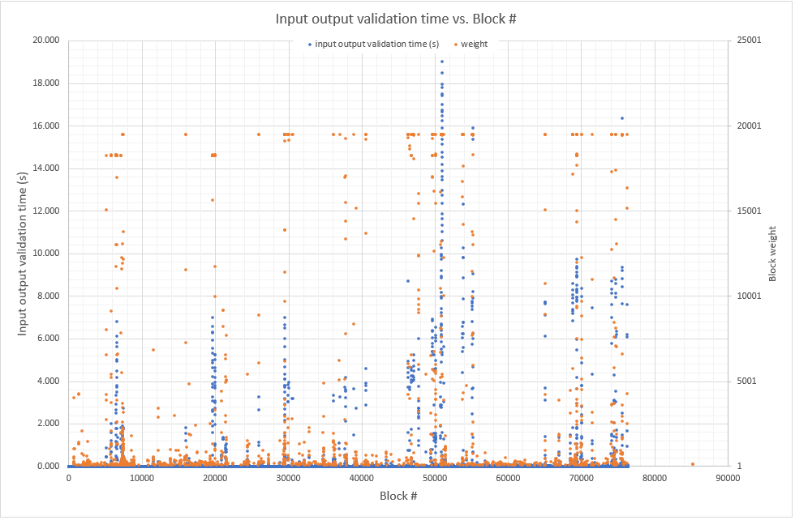
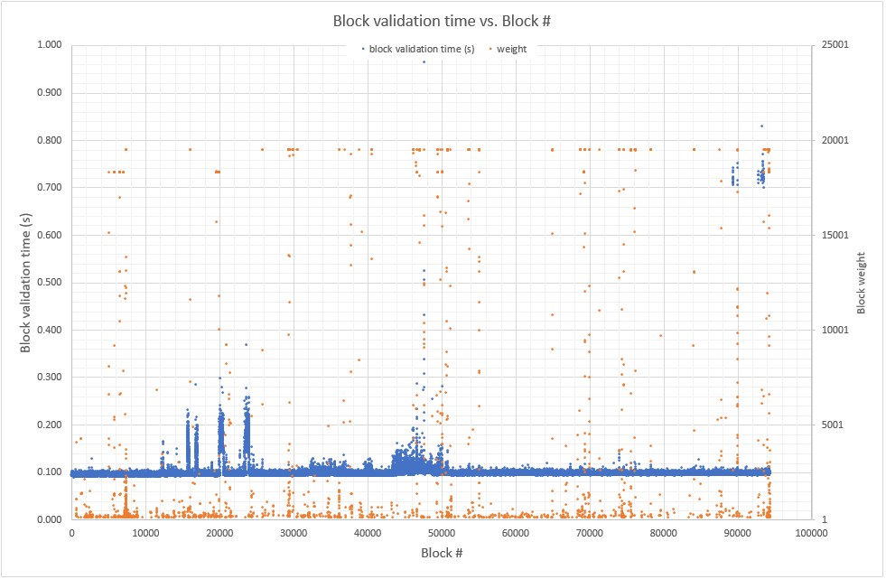
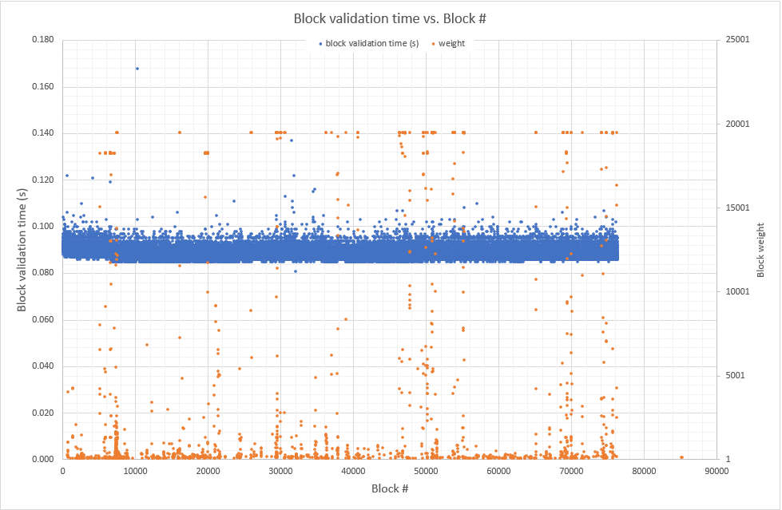

# Blockchain sync profiling: 2020/09/10 (during stress test) vs. 2020/09/06

## Test Description

Fresh base nodes [version ~`0.5.4-562a6b0-release`] were started (using Tor) in order to profile blockchain sync from scratch with trace logs being captured. The sync process could run to completion as there were no more limitations on initial database environment size. Analysis is based on detail time measurements in the code as well as differential time between specific consecutive trace logs. Differential analysis only uses log entries received with blocks in chronological order.

**Sync 2020/09/10**: [version ~`0.5.4-562a6b0-release`] A stress test was taking place during the sync period, from block 43411 onwards. The host machine was also used for other high intensity tasks during sync. Sync started when the blockchain tip was at block 94069 and caught up when the blockchain was at height 94396.

**Sync 2020/09/10**: [version ~`0.5.4-a2a16a1-release`] The host machine was only used for limited high intensity tasks during this time. Sync started when the blockchain tip was at block 91636 and caught up when the blockchain was at height 91981.

| Base Node             | Sync start time  (UCT) | Blockchain sync  stopped time (UCT) | Duration | Duration (s) | Sync started at  block | Sync stopped at  block | Blocks/s | Difference |
| --------------------- | ---------------------- | ----------------------------------- | -------- | ------------ | ---------------------- | ---------------------- | -------- | ---------- |
| Windows 02            | 2020/09/10  08:01      | 2020/09/11  00:59                   | 16:57:54 | 61074.00     | 94069                  | 94396                  | 1.55     | -27.81%    |
| Windows 02 (previous) | 2020/09/06  16:23      | 2020/09/07  04:19                   | 11:55:59 | 42959.00     | 91636                  | 91981                  | 2.14     | 0.00%      |

### General Profiling

These general profiling measurements are extracted form the logs. Currently requesting blocks and waiting for them to be received happens in series with block processing; new blocks are only requested after the previous blocks have been processed successfully.

| #    | Log Entry                                                    | Description               |
| ---- | ------------------------------------------------------------ | ------------------------- |
| 1    | Requesting blocks [1, 2, 3, 4, 5] from 6b4773e599143ba0f87db39da2. | Block request time        |
| 2    | Received 5 blocks from peer                                  | Block receive time        |
| 3    | Response for HistoricalBlocks (request key: 5564039840279151865) received  after 734ms | Network response (direct) |
| 4    | [add_block] Exited blocking thread after 154ms. trace_id: '4048701038' | Block processing time     |

### Block Processing Profile

The table below shows a typical trace log of a new block being received for processing after the previous block has been successfully added to the database. The numbers in `Diff. Time` indicate which log messages are extracted for differential time measurements to be done. The first measurement would be between `0` and `1`, the next one between `1` and  `2`, and so on for all blocks received as part of block sync.

| Diff. Time | Log Entry                                                    | Description                                   |
| ---------- | ------------------------------------------------------------ | --------------------------------------------- |
| 0          | Block #50880 (1b474c9f...) successfully added to database    | Reference point                               |
|            |                                                              |                                               |
| 1          | Block #50881 (6b9670bb...) received from local services      | Waiting for next block                        |
|            |                                                              |                                               |
|            | Entered blocking thread. trace_id: '330817698'               | Stateless validation                          |
|            | SV - Coinbase output is ok for block #50881 (6b9670bb...)    | Stateless validation                          |
|            | SV - Block contents for block #50881 : inputs 720; kernels 648; outputs 1295; weight 19499. | Stateless validation                          |
|            | SV - Block weight is ok for block #50881 (6b9670bb...)       | Stateless validation                          |
|            | SV - No duplicate inputs or outputs for block #50881 (6b9670bb...) | Stateless validation                          |
|            | SV - Output constraints are ok for block #50881 (6b9670bb...) | Stateless validation                          |
|            | SV - Cut-through is ok for block #50881 (6b9670bb...)        | Stateless validation                          |
|            | SV - accounting balance correct for block #50881 (6b9670bb...) | Stateless validation                          |
| 2          | block #50881 (6b9670bb...) has PASSED stateless VALIDATION check. | Stateless validation                          |
|            |                                                              |                                               |
|            | [add_block] acquired write access db lock for block #50881   | Blockchain integrity                          |
|            | Added candidate block #50881 (6b9670bb...) to the orphan database. Best height is 50880. | Blockchain integrity                          |
|            | Checking if block #50881 (6b9670bb...) is connected to the main chain. | Blockchain integrity                          |
|            | Connection with main chain found at block #50880 (1b474c9f...) from block #50881 (6b9670bb...). | Blockchain integrity                          |
|            | Search for orphan tips linked to block #50881 complete.      | Blockchain integrity                          |
|            | Comparing candidate block #50881  (accum_diff:15683896, hash:6b9670bb...) to main chain #50880 (accum_diff: 15683572, hash:  (1b474c9f...)). | Blockchain integrity                          |
| 3          | Accumulated difficulty validation PASSED for block #50881 (6b9670bb...) | Blockchain integrity (Difficulty  validation) |
|            |                                                              |                                               |
| 4          | Block validation: All inputs and outputs are valid for block #50881  (6b9670bb...) | Input/output validation                       |
|            |                                                              |                                               |
|            | Block validation: MMR roots are valid for block #50881 (6b9670bb...) | Block validation                              |
|            | BlockHeader validation: FTL timestamp is ok for header #50881  (6b9670bb...) | Block validation                              |
|            | BlockHeader validation: Median timestamp is ok for header #50881  (6b9670bb...) | Block validation                              |
|            | BlockHeader validation: Achieved difficulty is ok for header #50881  (6b9670bb...) | Block validation                              |
|            | Block header validation: BlockHeader is VALID for header #50881  (6b9670bb...) | Block validation                              |
| 5          | Block validation: Block is VALID for block #50881 (6b9670bb...) | Block validation                              |
|            |                                                              |                                               |
|            | [add_block] released write access db lock for block #50881   | Updating LMBD database                        |
|            | [add_block] Exited blocking thread after 22364ms. trace_id: '330817698' | Updating LMBD database                        |
| 6          | Block #50881 (6b9670bb...) successfully added to database    | Updating LMBD database                        |

## Results

**Note:** Processed data with plots can be downloaded from [Google Drive (_Engineering:Testnet-Rincewind:Profiling:blockchain_sync_20200827_)](https://drive.google.com/drive/folders/1-T5PRWUsPCIP7VJzu9VwxtNoeHxD13aq) and opened with Microsoft Excel or Libre Office Calc.

### Block Processing Profile

The detailed block sync profile, compared to the previous (undocumented) test, is shown below.

| Basenode              | Next block  receive (s) | Stateless  validation (s) | Blockchain  integrity (s) | I/O validation  (s) | Block validation  (s) | Add block to db  (s) | Totals   |
| --------------------- | ----------------------- | ------------------------- | ------------------------- | ------------------- | --------------------- | -------------------- | -------- |
| Windows 02            | 40334.08                | 2394.91                   | 1622.00                   | 4384.70             | 9197.52               | 3140.80              | 61074.00 |
| - Average             | 0.427286                | 0.025371                  | 0.017183                  | 0.046450            | 0.097435              | 0.033273             | 0.646998 |
| - Ratio               | 66.04%                  | 3.92%                     | 2.66%                     | 7.18%               | 15.06%                | 5.14%                | 100.00%  |
| Windows 02 (previous) | 26517.68                | 2039.25                   | 661.55                    | 2766.26             | 8170.19               | 2795.15              | 42950.09 |
| - Average             | 0.288295                | 0.022170                  | 0.007192                  | 0.030074            | 0.088825              | 0.030388             | 0.466945 |
| - Ratio               | 61.74%                  | 4.75%                     | 1.54%                     | 6.44%               | 19.02%                | 6.51%                | 100.00%  |
| Difference            | -48.21%                 | -14.44%                   | -138.91%                  | -54.45%             | -9.69%                | -9.49%               | -38.56%  |

### Network Performance

Network performance is measured with `Next block  receive time`, however, this average value may be slightly warped as blocks are received in groups. The table below shows average for groups of blocks.

| Description                                    | Windows 02 | Windows 02  (previous) |
| ---------------------------------------------- | ---------- | ---------------------- |
| Next block receive time, group of 5 blocks (s) | 2.135      | 1.439                  |
| Difference                                     | -32.59%    | 0.00%                  |

### Average vs. Maximum

Average vs. maximum values, compared to the previous (undocumented) test, is shown below.

| Basenode              | Aspect  | Next block  receive (s) | Stateless  validation (s) | Blockchain  integrity (s) | I/O validation  (s) | Block validation  (s) | Add block to db  (s) |
| --------------------- | ------- | ----------------------- | ------------------------- | ------------------------- | ------------------- | --------------------- | -------------------- |
| Windows 02            | Average | 0.427286                | 0.025371                  | 0.017183                  | 0.046450            | 0.097435              | 0.033273             |
| Windows 02            | Max     | 663.553000              | 64.555000                 | 6.014000                  | 27.055000           | 2.982000              | 4.966000             |
| Windows 02            | Factor  | 1552.95                 | 2544.46                   | 350.00                    | 582.45              | 30.60                 | 149.25               |
| Windows 02 (previous) | Average | 0.288295                | 0.022170                  | 0.007192                  | 0.030074            | 0.088825              | 0.030388             |
| Windows 02 (previous) | Max     | 662.601000              | 10.706000                 | 0.177000                  | 19.020000           | 0.168000              | 0.859000             |
| Windows 02 (previous) | Factor  | 2298.34                 | 482.90                    | 24.61                     | 632.43              | 1.89                  | 28.27                |
| Difference            | Average | -48.21%                 | -14.44%                   | -138.91%                  | -54.45%             | -9.69%                | -9.49%               |
| Difference            | Max     | -0.14%                  | -502.98%                  | -3297.74%                 | -42.25%             | -1675.00%             | -478.11%             |
| Difference            | Factor  | 32.43%                  | -426.91%                  | -1322.19%                 | 7.90%               | -1518.14%             | -428.00%             |

### Other Observations

- Some times the base node would wait for extended periods of time, up to 11 minutes, after the request for more blocks before they would be received.
- The `write access db lock` is acquired after _Stateless validation_ and released after the new block has been added to the database. This does not seem to have any adverse effect on processing, apart from where the database is updated.
- Block size correlation:

  - _Block validation_, _Blockchain integrity_ and _Add block to db_ are only moderately affected by block size (~ x30 above average)
  - _Stateless validation_ and _I/O validation_ are strongly affected by block size (~ x515 above average)
- Stress test correlation:
  - _Blockchain integrity_ and _Block validation_ showed increased processing times during stress test conditions.
  - _Blockchain integrity_ times were bloated during certain time intervals, due to adding blocks to the orphan database; this seems to correlate to times when the host machine was extremely busy.

## Conclusions

These results were discussed and the following conclusions were drawn: 

- General network conditions and host dedication seem to play a role in blockchain sync performance.
- The average blockchain sync performance (Block Processing Profile) correlates well between different tests.
- Areas for improvement:
  - Stream all block requests, without waiting for validation to be concluded for the next round to start. If a block in a group cannot be added to the database successfully, that group can be re-requested from a different host.
- Block processing bottlenecks, in order of time taken:
  - Block validation
  - I/O validation & Add block to db
  - Stateless validation

## Graphs

<b>Figure 1a : Next Block, Sync test 2020-09-10</b>

<b>Figure 1b : Next Block, Sync test 2020-09-06</b>

<b>Figure 2a : Stateless Validation, Sync test 2020-09-10</b>

<b>Figure 2b : Stateless Validation, Sync test 2020-09-06</b>

<b>Figure 3a : Blockchain Integrity, Sync test 2020-09-10</b>

<b>Figure 3b : Blockchain Integrity, Sync test 2020-09-06</b>

<b>Figure 4a : Input/Output Validation, Sync test 2020-09-10</b>

<b>Figure 4b : Input/Output Validation, Sync test 2020-09-06</b>

<b>Figure 5a : Block Validation, Sync test 2020-09-10</b>

<b>Figure 5b : Block Validation, Sync test 2020-09-06</b>

