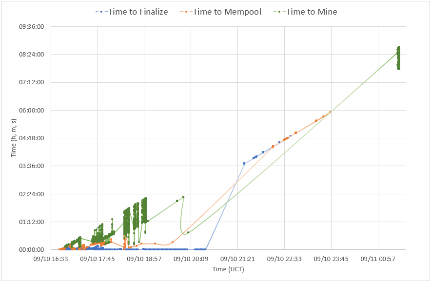
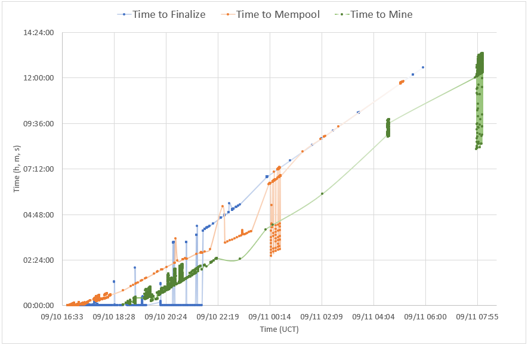
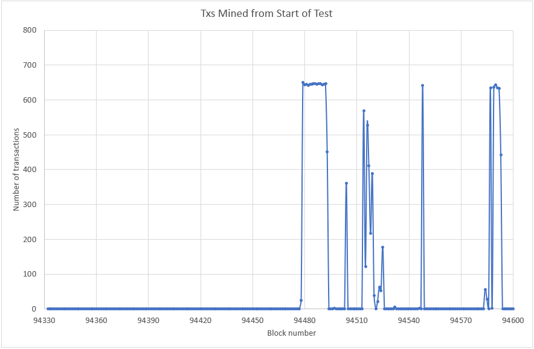
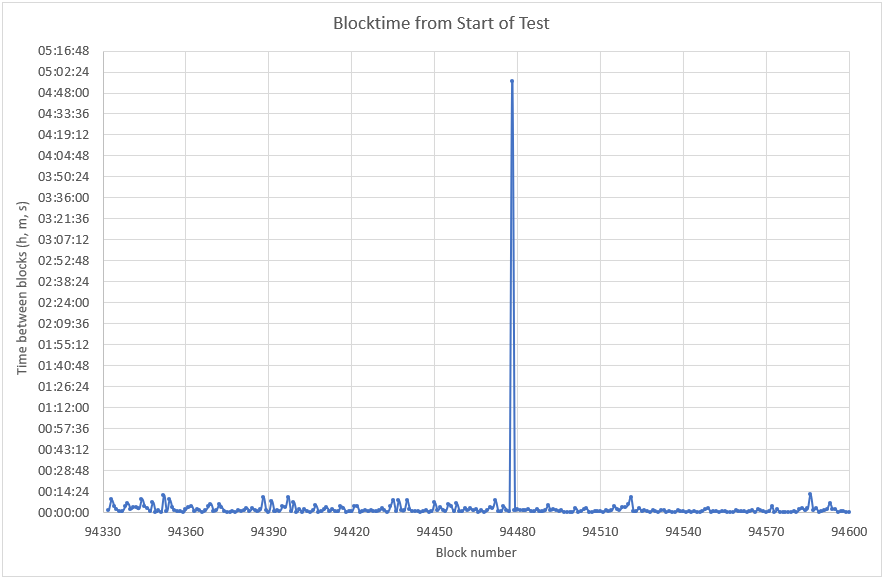
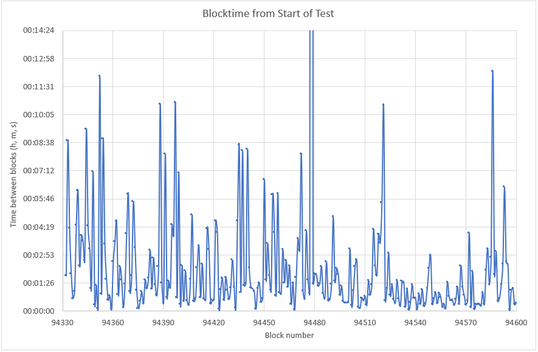

# Stress test of 2020/09/10: Analysis

## Test Summary

Due to network segregation effects this stress test was not very successful; only 46.4% of the 36210 submitted transactions were mined in just under 14 hours, which translates to 0.335 Txs/s. The 6 sending wallets collectively detected 71.8% of those transactions to have been mined. This difference between number of transactions detected as mined vs. those that were actually mined can only be ascribed to network segregation. A massive blockchain reorg removed 31.8% [(24604 - 16784) / 24604] successful transactions that were previously detected as mined.

The first bunch of transactions submitted to the mempool were only mined 147 blocks after the test started, as is evident in the actual blockchain data.

Overall progress:

| General  Timings            | UCT                 | Block |
| --------------------------- | ------------------- | ----- |
| First Tx submitted:         | 2020/09/10 16:46:36 | 94332 |
| Last Tx submitted:          | 2020/09/10 21:43:23 | 94451 |
| Sending wallets shut  down: | 2020/09/11 06:08:27 | 94586 |
| Sending wallets  restart:   | 2020/09/11 07:59:18 | 94663 |


Transaction throughput:

| Description                          | Txs   | blocks | Txs/s | Total time |
| ------------------------------------ | ----- | ------ | ----- | ---------- |
| Theoretical limits at 650 Txs/block: | 32696 | 56     | 5.417 | 01:52:00   |
| Blocks with Txs:                     | 16784 | 45     | 0.335 | 13:53:50   |


Actual Txs mined:

| Description                                            | Value    |
| ------------------------------------------------------ | -------- |
| Estimated time to  submit all transactions:            | 00:45:53 |
| Actual time to  submit all transactions:               | 04:56:47 |
| Actual Txs mined (of submitted) - Blockchain:          | 46.4%    |
| Actual Txs mined (of negotiated) - Blockchain:         | 51.3%    |
| Perceived Txs mined (of submitted) - Sending wallets:  | 71.8%    |
| Perceived Txs mined (of negotiated) - Sending wallets: | 79.6%    |

## Sending and Receiving Wallets' Perspective

All the data below was collected and processed from base node log files.

### Statistics

Sending wallets:

| Node          | Txs submitted | Txs negotiated | Unconfirmed     pool | Unconfirmed     pool (after restart) | Detected as  mined | Detected as  mined (after restart) | Pending |
| ------------- | ------------- | -------------- | -------------------- | ------------------------------------ | ------------------ | ---------------------------------- | ------- |
| pluto win 01  | 6120          | 5623           | 5014                 | 35                                   | 4534               | 341                                | 468     |
| pluto win 02  | 6120          | 5661           | 5158                 | 33                                   | 4563               | 386                                | 431     |
| pluto win 03  | 6120          | 5601           | 5128                 | 32                                   | 4385               | 442                                | 495     |
| hansie win 01 | 6120          | 5526           | 5197                 | 29                                   | 3696               | 39                                 | 578     |
| hansie win 02 | 6120          | 5400           | 5166                 | 81                                   | 3891               | 81                                 | 651     |
| hansie win 03 | 5610          | 4885           | 4692                 | 120                                  | 3535               | 120                                | 617     |
| Totals        | 36210         | 32696          | 30355                | 330                                  | 24604              | 1409                               | 3240    |
| Percentages   | 100.0%        | 90.3%          | 83.8%                | 0.9% <br />(**84.7%** inclusive)     | 67.9%              | 3.9% <br />(**71.8%** inclusive)   | 8.9%    |


Receiving wallets:

| Description (3060 sent to each receiving wallet)             | Byron | Byron (%) | Philip | Philip (%) | Bob  | Bob (%) |
| ------------------------------------------------------------ | ----- | --------- | ------ | ---------- | ---- | ------- |
| Transaction  Replies queued with Message                     | 3060  | 100.0%    | 3057   | 99.9%      | 3023 | 98.8%   |
| Finalized  Transaction received                              | 3014  | 98.5%     | 3055   | 99.8%      | 2874 | 93.9%   |
| Completed  Transaction detected as Broadcast to Base Node Mempool in UnconfirmedPool | 2817  | 92.1%     | 2092   | 68.4%      | 2002 | 65.4%   |
| Transaction  detected as mined on the Base Layer             | 1769  | 57.8%     | 2092   | 68.4%      | 1942 | 63.5%   |

### Timings

Time measurements for two of the sending wallets, where transactions have been tracked according to their transaction ID, are shown below. These measurements include time to finalize the transaction, time to get confirmation that it is in the mempool and lastly, time to be mined, all relative to the time a transaction was submitted.

Node timings: _pluto win 01_

<p align="center"></p>

Node timings: _hansie win 01_

<p align="center"></p>

It can be seen that generally transactions were negotiated really quickly, until everything slowed down dramatically at ~21:45 UCT, after ~5 hours. 

## Network Messaging Performance

Only 3.2% of transactions that were sent during the initial round were reported to have an error; all of those were successfully sent to neighbors via Store & Forward.

| Node          | Txs attempted | Initial direct  send success | Initial direct  send errors | Initial S&F  successful | Txs submitted  -     total |
| ------------- | ------------- | ---------------------------- | --------------------------- | ----------------------- | -------------------------- |
| pluto win 01  | 6120          | 5761                         | 359                         | 359                     | 6120                       |
| pluto win 02  | 6120          | 5912                         | 208                         | 208                     | 6120                       |
| pluto win 03  | 6120          | 5888                         | 232                         | 232                     | 6120                       |
| hansie win 01 | 6120          | 5950                         | 170                         | 170                     | 6120                       |
| hansie win 02 | 6120          | 5950                         | 170                         | 170                     | 6120                       |
| hansie win 03 | 5610          | 5592                         | 18                          | 18                      | 5610                       |
| Totals        | 36210         | 35053                        | 1157                        | 1157                    | 36210                      |
|               | 100.0%        | 96.8%                        | 3.2%                        | 3.2%                    | 100.0%                     |


Due to configurable buffer sizes and rate limits for the base node and base node wallet respectively, no messages were dropped in the sending wallets or their base nodes. Limits used are set out below:

```
[common]

buffer_size_base_node = 1500
buffer_size_base_node_wallet = 50000
buffer_rate_limit_base_node = 1000
buffer_rate_limit_base_node_wallet = 1000

[wallet]

base_node_query_timeout = 900
transaction_broadcast_monitoring_timeout = 600
transaction_chain_monitoring_timeout = 15
transaction_direct_send_timeout = 600
transaction_broadcast_send_timeout = 600
```


## Actual Blockchain Data

Blocks with 1 or more Txs totaled 41, as listed below. The hugely delayed block time of 04:55:59 for block 94478 coincides with the first block where stress test transactions were mined, 24 in total.


### Transactions Mined

<p align="center"></p>


### Block Time

<p align="center"></p>

<p align="center"></p>


### Blockchain Statistics


| #    | Progress          | Block # | UCT      | Blocktime | Tx kernels | Tx inputs | Tx outputs |
| ---- | ----------------- | ------- | -------- | --------- | ---------- | --------- | ---------- |
| -1   |                   | 94331   | 16:37:54 | 00:01:06  | 1          | 0         | 1          |
| 0    | Test start        | 94332   | 16:39:42 | 00:01:48  | 1          | 0         | 1          |
| 1    |                   | 94333   | 16:48:27 | 00:08:45  | 1          | 0         | 1          |
| 2    |                   | 94334   | 16:52:42 | 00:04:15  | 1          | 0         | 1          |
| 3    |                   | 94335   | 16:54:37 | 00:01:55  | 1          | 0         | 1          |
| 4    |                   | 94336   | 16:55:16 | 00:00:39  | 1          | 0         | 1          |
| 5    |                   | 94337   | 16:56:16 | 00:01:00  | 1          | 0         | 1          |
| 6    |                   | 94338   | 17:00:39 | 00:04:23  | 1          | 0         | 1          |
| 7    |                   | 94339   | 17:06:50 | 00:06:11  | 1          | 0         | 1          |
| 8    |                   | 94340   | 17:09:09 | 00:02:19  | 1          | 0         | 1          |
| 9    |                   | 94341   | 17:13:01 | 00:03:52  | 1          | 0         | 1          |
| 10   |                   | 94342   | 17:16:35 | 00:03:34  | 1          | 0         | 1          |
| 11   |                   | 94343   | 17:19:10 | 00:02:35  | 1          | 0         | 1          |
| 12   |                   | 94344   | 17:28:30 | 00:09:20  | 1          | 0         | 1          |
| 13   |                   | 94345   | 17:32:52 | 00:04:22  | 1          | 0         | 1          |
| 14   |                   | 94346   | 17:36:03 | 00:03:11  | 1          | 0         | 1          |
| 15   |                   | 94347   | 17:37:12 | 00:01:09  | 1          | 0         | 1          |
| 16   |                   | 94348   | 17:44:21 | 00:07:09  | 1          | 0         | 1          |
| 17   |                   | 94349   | 17:44:40 | 00:00:19  | 1          | 0         | 1          |
| 18   |                   | 94350   | 17:45:59 | 00:01:19  | 1          | 0         | 1          |
| 19   |                   | 94351   | 17:46:08 | 00:00:09  | 1          | 0         | 1          |
| 20   |                   | 94352   | 17:58:10 | 00:12:02  | 1          | 0         | 1          |
| 21   |                   | 94353   | 17:59:03 | 00:00:53  | 1          | 0         | 1          |
| 22   |                   | 94354   | 18:07:54 | 00:08:51  | 1          | 0         | 1          |
| 23   |                   | 94355   | 18:11:20 | 00:03:26  | 1          | 0         | 1          |
| 24   |                   | 94356   | 18:12:58 | 00:01:38  | 1          | 0         | 1          |
| 25   |                   | 94357   | 18:13:32 | 00:00:34  | 1          | 0         | 1          |
| 26   |                   | 94358   | 18:14:18 | 00:00:46  | 1          | 0         | 1          |
| 27   |                   | 94359   | 18:14:25 | 00:00:07  | 1          | 0         | 1          |
| 28   |                   | 94360   | 18:16:55 | 00:02:30  | 1          | 0         | 1          |
| 29   |                   | 94361   | 18:20:28 | 00:03:33  | 1          | 0         | 1          |
| 30   |                   | 94362   | 18:25:03 | 00:04:35  | 1          | 0         | 1          |
| 31   |                   | 94363   | 18:25:53 | 00:00:50  | 1          | 0         | 1          |
| 32   |                   | 94364   | 18:28:08 | 00:02:15  | 1          | 0         | 1          |
| 33   |                   | 94365   | 18:29:43 | 00:01:35  | 1          | 0         | 1          |
| 34   |                   | 94366   | 18:29:54 | 00:00:11  | 1          | 0         | 1          |
| 35   |                   | 94367   | 18:31:16 | 00:01:22  | 1          | 0         | 1          |
| 36   |                   | 94368   | 18:35:15 | 00:03:59  | 1          | 0         | 1          |
| 37   |                   | 94369   | 18:41:14 | 00:05:59  | 1          | 0         | 1          |
| 38   |                   | 94370   | 18:42:14 | 00:01:00  | 1          | 0         | 1          |
| 39   |                   | 94371   | 18:44:03 | 00:01:49  | 1          | 0         | 1          |
| 40   |                   | 94372   | 18:49:39 | 00:05:36  | 1          | 0         | 1          |
| 41   |                   | 94373   | 18:52:55 | 00:03:16  | 1          | 0         | 1          |
| 42   |                   | 94374   | 18:53:59 | 00:01:04  | 1          | 0         | 1          |
| 43   |                   | 94375   | 18:54:07 | 00:00:08  | 1          | 0         | 1          |
| 44   |                   | 94376   | 18:54:37 | 00:00:30  | 1          | 0         | 1          |
| 45   |                   | 94377   | 18:55:36 | 00:00:59  | 1          | 0         | 1          |
| 46   |                   | 94378   | 18:55:59 | 00:00:23  | 1          | 0         | 1          |
| 47   |                   | 94379   | 18:57:34 | 00:01:35  | 1          | 0         | 1          |
| 48   |                   | 94380   | 18:58:43 | 00:01:09  | 1          | 0         | 1          |
| 49   |                   | 94381   | 19:00:24 | 00:01:41  | 1          | 0         | 1          |
| 50   |                   | 94382   | 19:03:31 | 00:03:07  | 1          | 0         | 1          |
| 51   |                   | 94383   | 19:04:39 | 00:01:08  | 1          | 0         | 1          |
| 52   |                   | 94384   | 19:07:23 | 00:02:44  | 1          | 0         | 1          |
| 53   |                   | 94385   | 19:08:43 | 00:01:20  | 1          | 0         | 1          |
| 54   |                   | 94386   | 19:09:31 | 00:00:48  | 1          | 0         | 1          |
| 55   |                   | 94387   | 19:11:47 | 00:02:16  | 1          | 0         | 1          |
| 56   |                   | 94388   | 19:22:25 | 00:10:38  | 1          | 0         | 1          |
| 57   |                   | 94389   | 19:23:51 | 00:01:26  | 1          | 0         | 1          |
| 58   |                   | 94390   | 19:24:17 | 00:00:26  | 1          | 0         | 1          |
| 59   |                   | 94391   | 19:32:20 | 00:08:03  | 1          | 0         | 1          |
| 60   |                   | 94392   | 19:33:02 | 00:00:42  | 1          | 0         | 1          |
| 61   |                   | 94393   | 19:34:34 | 00:01:32  | 1          | 0         | 1          |
| 62   |                   | 94394   | 19:35:46 | 00:01:12  | 1          | 0         | 1          |
| 63   |                   | 94395   | 19:40:13 | 00:04:27  | 1          | 0         | 1          |
| 64   |                   | 94396   | 19:44:05 | 00:03:52  | 1          | 0         | 1          |
| 65   |                   | 94397   | 19:54:46 | 00:10:41  | 1          | 0         | 1          |
| 66   |                   | 94398   | 19:55:28 | 00:00:42  | 1          | 0         | 1          |
| 67   |                   | 94399   | 20:02:35 | 00:07:07  | 1          | 0         | 1          |
| 68   |                   | 94400   | 20:02:56 | 00:00:21  | 1          | 0         | 1          |
| 69   |                   | 94401   | 20:05:16 | 00:02:20  | 1          | 0         | 1          |
| 70   |                   | 94402   | 20:05:46 | 00:00:30  | 1          | 0         | 1          |
| 71   |                   | 94403   | 20:07:49 | 00:02:03  | 1          | 0         | 1          |
| 72   |                   | 94404   | 20:08:20 | 00:00:31  | 1          | 0         | 1          |
| 73   |                   | 94405   | 20:08:39 | 00:00:19  | 1          | 0         | 1          |
| 74   |                   | 94406   | 20:10:16 | 00:01:37  | 1          | 0         | 1          |
| 75   |                   | 94407   | 20:15:11 | 00:04:55  | 1          | 0         | 1          |
| 76   |                   | 94408   | 20:15:41 | 00:00:30  | 1          | 0         | 1          |
| 77   |                   | 94409   | 20:16:19 | 00:00:38  | 1          | 0         | 1          |
| 78   |                   | 94410   | 20:18:33 | 00:02:14  | 1          | 0         | 1          |
| 79   |                   | 94411   | 20:21:53 | 00:03:20  | 1          | 0         | 1          |
| 80   |                   | 94412   | 20:22:35 | 00:00:42  | 1          | 0         | 1          |
| 81   |                   | 94413   | 20:25:00 | 00:02:25  | 1          | 0         | 1          |
| 82   |                   | 94414   | 20:25:39 | 00:00:39  | 1          | 0         | 1          |
| 83   |                   | 94415   | 20:26:12 | 00:00:33  | 1          | 0         | 1          |
| 84   |                   | 94416   | 20:30:26 | 00:04:14  | 1          | 0         | 1          |
| 85   |                   | 94417   | 20:33:35 | 00:03:09  | 1          | 0         | 1          |
| 86   |                   | 94418   | 20:33:58 | 00:00:23  | 1          | 0         | 1          |
| 87   |                   | 94419   | 20:34:31 | 00:00:33  | 1          | 0         | 1          |
| 88   |                   | 94420   | 20:35:05 | 00:00:34  | 1          | 0         | 1          |
| 89   |                   | 94421   | 20:39:42 | 00:04:37  | 1          | 0         | 1          |
| 90   |                   | 94422   | 20:43:44 | 00:04:02  | 1          | 0         | 1          |
| 91   |                   | 94423   | 20:43:50 | 00:00:06  | 1          | 0         | 1          |
| 92   |                   | 94424   | 20:44:55 | 00:01:05  | 1          | 0         | 1          |
| 93   |                   | 94425   | 20:46:36 | 00:01:41  | 1          | 0         | 1          |
| 94   |                   | 94426   | 20:47:09 | 00:00:33  | 1          | 0         | 1          |
| 95   |                   | 94427   | 20:48:53 | 00:01:44  | 1          | 0         | 1          |
| 96   |                   | 94428   | 20:49:57 | 00:01:04  | 1          | 0         | 1          |
| 97   |                   | 94429   | 20:50:33 | 00:00:36  | 1          | 0         | 1          |
| 98   |                   | 94430   | 20:51:46 | 00:01:13  | 1          | 0         | 1          |
| 99   |                   | 94431   | 20:54:23 | 00:02:37  | 1          | 0         | 1          |
| 100  |                   | 94432   | 20:55:38 | 00:01:15  | 1          | 0         | 1          |
| 101  |                   | 94433   | 20:55:48 | 00:00:10  | 1          | 0         | 1          |
| 102  |                   | 94434   | 21:00:24 | 00:04:36  | 1          | 0         | 1          |
| 103  |                   | 94435   | 21:08:56 | 00:08:32  | 1          | 0         | 1          |
| 104  |                   | 94436   | 21:09:54 | 00:00:58  | 1          | 0         | 1          |
| 105  |                   | 94437   | 21:18:08 | 00:08:14  | 1          | 0         | 1          |
| 106  |                   | 94438   | 21:19:26 | 00:01:18  | 1          | 0         | 1          |
| 107  |                   | 94439   | 21:20:50 | 00:01:24  | 1          | 0         | 1          |
| 108  |                   | 94440   | 21:29:08 | 00:08:18  | 1          | 0         | 1          |
| 109  |                   | 94441   | 21:31:22 | 00:02:14  | 1          | 0         | 1          |
| 110  |                   | 94442   | 21:32:34 | 00:01:12  | 1          | 0         | 1          |
| 111  |                   | 94443   | 21:33:43 | 00:01:09  | 1          | 0         | 1          |
| 112  |                   | 94444   | 21:34:43 | 00:01:00  | 1          | 0         | 1          |
| 113  |                   | 94445   | 21:34:49 | 00:00:06  | 1          | 0         | 1          |
| 114  |                   | 94446   | 21:35:59 | 00:01:10  | 1          | 0         | 1          |
| 115  |                   | 94447   | 21:37:25 | 00:01:26  | 1          | 0         | 1          |
| 116  |                   | 94448   | 21:37:52 | 00:00:27  | 1          | 0         | 1          |
| 117  |                   | 94449   | 21:38:30 | 00:00:38  | 1          | 0         | 1          |
| 118  |                   | 94450   | 21:45:15 | 00:06:45  | 1          | 0         | 1          |
| 119  | Last Tx submitted | 94451   | 21:46:51 | 00:01:36  | 1          | 0         | 1          |
| 120  |                   | 94452   | 21:50:19 | 00:03:28  | 1          | 0         | 1          |
| 121  |                   | 94453   | 21:52:08 | 00:01:49  | 1          | 0         | 1          |
| 122  |                   | 94454   | 21:53:11 | 00:01:03  | 1          | 0         | 1          |
| 123  |                   | 94455   | 21:59:08 | 00:05:57  | 1          | 0         | 1          |
| 124  |                   | 94456   | 22:03:11 | 00:04:03  | 1          | 0         | 1          |
| 125  |                   | 94457   | 22:03:58 | 00:00:47  | 1          | 0         | 1          |
| 126  |                   | 94458   | 22:10:01 | 00:06:03  | 1          | 0         | 1          |
| 127  |                   | 94459   | 22:10:59 | 00:00:58  | 1          | 0         | 1          |
| 128  |                   | 94460   | 22:11:51 | 00:00:52  | 1          | 0         | 1          |
| 129  |                   | 94461   | 22:15:00 | 00:03:09  | 1          | 0         | 1          |
| 130  |                   | 94462   | 22:16:28 | 00:01:28  | 1          | 0         | 1          |
| 131  |                   | 94463   | 22:19:04 | 00:02:36  | 1          | 0         | 1          |
| 132  |                   | 94464   | 22:20:18 | 00:01:14  | 1          | 0         | 1          |
| 133  |                   | 94465   | 22:22:37 | 00:02:19  | 1          | 0         | 1          |
| 134  |                   | 94466   | 22:22:58 | 00:00:21  | 1          | 0         | 1          |
| 135  |                   | 94467   | 22:24:25 | 00:01:27  | 1          | 0         | 1          |
| 136  |                   | 94468   | 22:24:28 | 00:00:03  | 1          | 0         | 1          |
| 137  |                   | 94469   | 22:26:12 | 00:01:44  | 1          | 0         | 1          |
| 138  |                   | 94470   | 22:29:55 | 00:03:43  | 1          | 0         | 1          |
| 139  |                   | 94471   | 22:33:02 | 00:03:07  | 1          | 0         | 1          |
| 140  |                   | 94472   | 22:41:06 | 00:08:04  | 1          | 0         | 1          |
| 141  |                   | 94473   | 22:42:07 | 00:01:01  | 1          | 0         | 1          |
| 142  |                   | 94474   | 22:42:44 | 00:00:37  | 1          | 0         | 1          |
| 143  |                   | 94475   | 22:46:51 | 00:04:07  | 1          | 0         | 1          |
| 144  |                   | 94476   | 22:48:27 | 00:01:36  | 1          | 0         | 1          |
| 145  |                   | 94477   | 22:49:21 | 00:00:54  | 1          | 0         | 1          |
| 146  | First bunch mined | 94478   | 03:45:20 | 04:55:59  | 25         | 24        | 49         |
| 147  |                   | 94479   | 03:46:45 | 00:01:25  | 650        | 651       | 1299       |
| 148  |                   | 94480   | 03:48:39 | 00:01:54  | 643        | 842       | 1285       |
| 149  |                   | 94481   | 03:50:31 | 00:01:52  | 645        | 799       | 1288       |
| 150  |                   | 94482   | 03:51:48 | 00:01:17  | 641        | 909       | 1281       |
| 151  |                   | 94483   | 03:53:12 | 00:01:24  | 645        | 801       | 1289       |
| 152  |                   | 94484   | 03:55:29 | 00:02:17  | 645        | 779       | 1289       |
| 153  |                   | 94485   | 03:56:24 | 00:00:55  | 647        | 735       | 1293       |
| 154  |                   | 94486   | 03:57:03 | 00:00:39  | 647        | 736       | 1293       |
| 155  |                   | 94487   | 03:59:34 | 00:02:31  | 645        | 789       | 1289       |
| 156  |                   | 94488   | 04:00:06 | 00:00:32  | 646        | 775       | 1291       |
| 157  |                   | 94489   | 04:00:42 | 00:00:36  | 647        | 732       | 1293       |
| 158  |                   | 94490   | 04:02:05 | 00:01:23  | 644        | 837       | 1287       |
| 159  |                   | 94491   | 04:06:54 | 00:04:49  | 645        | 779       | 1289       |
| 160  |                   | 94492   | 04:08:25 | 00:01:31  | 646        | 767       | 1291       |
| 161  |                   | 94493   | 04:10:36 | 00:02:11  | 451        | 601       | 901        |
| 162  |                   | 94494   | 04:12:29 | 00:01:53  | 1          | 0         | 1          |
| 163  |                   | 94495   | 04:13:18 | 00:00:49  | 1          | 0         | 1          |
| 164  |                   | 94496   | 04:14:34 | 00:01:16  | 1          | 0         | 1          |
| 165  |                   | 94497   | 04:15:03 | 00:00:29  | 2          | 1         | 3          |
| 166  |                   | 94498   | 04:15:29 | 00:00:26  | 1          | 0         | 1          |
| 167  |                   | 94499   | 04:15:55 | 00:00:26  | 1          | 0         | 1          |
| 168  |                   | 94500   | 04:16:22 | 00:00:27  | 1          | 0         | 1          |
| 169  |                   | 94501   | 04:19:33 | 00:03:11  | 1          | 0         | 1          |
| 170  |                   | 94502   | 04:19:50 | 00:00:17  | 1          | 0         | 1          |
| 171  |                   | 94503   | 04:20:51 | 00:01:01  | 1          | 0         | 1          |
| 172  |                   | 94504   | 04:23:08 | 00:02:17  | 361        | 467       | 721        |
| 173  |                   | 94505   | 04:25:45 | 00:02:37  | 1          | 0         | 1          |
| 174  |                   | 94506   | 04:25:57 | 00:00:12  | 1          | 0         | 1          |
| 175  |                   | 94507   | 04:26:06 | 00:00:09  | 1          | 0         | 1          |
| 176  |                   | 94508   | 04:26:47 | 00:00:41  | 1          | 0         | 1          |
| 177  |                   | 94509   | 04:27:19 | 00:00:32  | 1          | 0         | 1          |
| 178  |                   | 94510   | 04:28:04 | 00:00:45  | 1          | 0         | 1          |
| 179  |                   | 94511   | 04:28:22 | 00:00:18  | 1          | 0         | 1          |
| 180  |                   | 94512   | 04:29:55 | 00:01:33  | 1          | 0         | 1          |
| 181  |                   | 94513   | 04:30:44 | 00:00:49  | 1          | 0         | 1          |
| 182  |                   | 94514   | 04:32:05 | 00:01:21  | 568        | 651       | 1135       |
| 183  |                   | 94515   | 04:36:17 | 00:04:12  | 122        | 135       | 243        |
| 184  |                   | 94516   | 04:38:35 | 00:02:18  | 528        | 874       | 1055       |
| 185  |                   | 94517   | 04:40:25 | 00:01:50  | 411        | 573       | 821        |
| 186  |                   | 94518   | 04:44:21 | 00:03:56  | 217        | 287       | 433        |
| 187  |                   | 94519   | 04:47:51 | 00:03:30  | 388        | 555       | 775        |
| 188  |                   | 94520   | 04:53:25 | 00:05:34  | 39         | 41        | 77         |
| 189  |                   | 94521   | 05:03:57 | 00:10:32  | 1          | 0         | 1          |
| 190  |                   | 94522   | 05:04:29 | 00:00:32  | 21         | 20        | 41         |
| 191  |                   | 94523   | 05:05:40 | 00:01:11  | 63         | 71        | 125        |
| 192  |                   | 94524   | 05:08:39 | 00:02:59  | 53         | 59        | 105        |
| 193  |                   | 94525   | 05:09:27 | 00:00:48  | 177        | 198       | 353        |
| 194  |                   | 94526   | 05:10:48 | 00:01:21  | 1          | 0         | 1          |
| 195  |                   | 94527   | 05:11:24 | 00:00:36  | 1          | 0         | 1          |
| 196  |                   | 94528   | 05:11:49 | 00:00:25  | 1          | 0         | 1          |
| 197  |                   | 94529   | 05:13:22 | 00:01:33  | 1          | 0         | 1          |
| 198  |                   | 94530   | 05:14:00 | 00:00:38  | 1          | 0         | 1          |
| 199  |                   | 94531   | 05:14:16 | 00:00:16  | 1          | 0         | 1          |
| 200  |                   | 94532   | 05:15:48 | 00:01:32  | 6          | 7         | 11         |
| 201  |                   | 94533   | 05:17:16 | 00:01:28  | 1          | 0         | 1          |
| 202  |                   | 94534   | 05:17:28 | 00:00:12  | 1          | 0         | 1          |
| 203  |                   | 94535   | 05:18:36 | 00:01:08  | 1          | 0         | 1          |
| 204  |                   | 94536   | 05:18:40 | 00:00:04  | 1          | 0         | 1          |
| 205  |                   | 94537   | 05:19:07 | 00:00:27  | 1          | 0         | 1          |
| 206  |                   | 94538   | 05:20:28 | 00:01:21  | 1          | 0         | 1          |
| 207  |                   | 94539   | 05:21:08 | 00:00:40  | 1          | 0         | 1          |
| 208  |                   | 94540   | 05:21:48 | 00:00:40  | 1          | 0         | 1          |
| 209  |                   | 94541   | 05:21:52 | 00:00:04  | 1          | 0         | 1          |
| 210  |                   | 94542   | 05:22:45 | 00:00:53  | 1          | 0         | 1          |
| 211  |                   | 94543   | 05:23:06 | 00:00:21  | 1          | 0         | 1          |
| 212  |                   | 94544   | 05:24:12 | 00:01:06  | 1          | 0         | 1          |
| 213  |                   | 94545   | 05:24:27 | 00:00:15  | 1          | 0         | 1          |
| 214  |                   | 94546   | 05:24:51 | 00:00:24  | 2          | 2         | 3          |
| 215  |                   | 94547   | 05:26:01 | 00:01:10  | 1          | 0         | 1          |
| 216  |                   | 94548   | 05:28:13 | 00:02:12  | 641        | 915       | 1281       |
| 217  |                   | 94549   | 05:31:03 | 00:02:50  | 1          | 0         | 1          |
| 218  |                   | 94550   | 05:31:24 | 00:00:21  | 1          | 0         | 1          |
| 219  |                   | 94551   | 05:32:02 | 00:00:38  | 1          | 0         | 1          |
| 220  |                   | 94552   | 05:32:59 | 00:00:57  | 1          | 0         | 1          |
| 221  |                   | 94553   | 05:33:22 | 00:00:23  | 1          | 0         | 1          |
| 222  |                   | 94554   | 05:34:17 | 00:00:55  | 1          | 0         | 1          |
| 223  |                   | 94555   | 05:35:00 | 00:00:43  | 1          | 0         | 1          |
| 224  |                   | 94556   | 05:35:12 | 00:00:12  | 1          | 0         | 1          |
| 225  |                   | 94557   | 05:35:34 | 00:00:22  | 1          | 0         | 1          |
| 226  |                   | 94558   | 05:35:42 | 00:00:08  | 1          | 0         | 1          |
| 227  |                   | 94559   | 05:37:11 | 00:01:29  | 1          | 0         | 1          |
| 228  |                   | 94560   | 05:37:55 | 00:00:44  | 1          | 0         | 1          |
| 229  |                   | 94561   | 05:38:27 | 00:00:32  | 1          | 0         | 1          |
| 230  |                   | 94562   | 05:39:00 | 00:00:33  | 1          | 0         | 1          |
| 231  |                   | 94563   | 05:39:18 | 00:00:18  | 1          | 0         | 1          |
| 232  |                   | 94564   | 05:39:53 | 00:00:35  | 1          | 0         | 1          |
| 233  |                   | 94565   | 05:41:08 | 00:01:15  | 1          | 0         | 1          |
| 234  |                   | 94566   | 05:41:30 | 00:00:22  | 1          | 0         | 1          |
| 235  |                   | 94567   | 05:43:49 | 00:02:19  | 1          | 0         | 1          |
| 236  |                   | 94568   | 05:45:04 | 00:01:15  | 1          | 0         | 1          |
| 237  |                   | 94569   | 05:45:52 | 00:00:48  | 1          | 0         | 1          |
| 238  |                   | 94570   | 05:46:11 | 00:00:19  | 1          | 0         | 1          |
| 239  |                   | 94571   | 05:46:42 | 00:00:31  | 1          | 0         | 1          |
| 240  |                   | 94572   | 05:50:43 | 00:04:01  | 1          | 0         | 1          |
| 241  |                   | 94573   | 05:50:56 | 00:00:13  | 1          | 0         | 1          |
| 242  |                   | 94574   | 05:52:57 | 00:02:01  | 1          | 0         | 1          |
| 243  |                   | 94575   | 05:53:03 | 00:00:06  | 1          | 0         | 1          |
| 244  |                   | 94576   | 05:53:24 | 00:00:21  | 1          | 0         | 1          |
| 245  |                   | 94577   | 05:53:44 | 00:00:20  | 1          | 0         | 1          |
| 246  |                   | 94578   | 05:54:06 | 00:00:22  | 1          | 0         | 1          |
| 247  |                   | 94579   | 05:54:22 | 00:00:16  | 1          | 0         | 1          |
| 248  |                   | 94580   | 05:55:20 | 00:00:58  | 1          | 0         | 1          |
| 249  |                   | 94581   | 05:55:40 | 00:00:20  | 1          | 0         | 1          |
| 250  |                   | 94582   | 05:57:45 | 00:02:05  | 1          | 0         | 1          |
| 251  |                   | 94583   | 06:00:57 | 00:03:12  | 1          | 0         | 1          |
| 252  |                   | 94584   | 06:02:18 | 00:01:21  | 56         | 55        | 111        |
| 253  |                   | 94585   | 06:05:04 | 00:02:46  | 29         | 28        | 57         |
| 254  |                   | 94586   | 06:17:22 | 00:12:18  | 1          | 0         | 1          |
| 255  |                   | 94587   | 06:19:14 | 00:01:52  | 635        | 1083      | 1269       |
| 256  |                   | 94588   | 06:22:18 | 00:03:04  | 2          | 1         | 3          |
| 257  |                   | 94589   | 06:22:48 | 00:00:30  | 637        | 1019      | 1273       |
| 258  |                   | 94590   | 06:23:27 | 00:00:39  | 644        | 830       | 1287       |
| 259  |                   | 94591   | 06:24:47 | 00:01:20  | 635        | 1075      | 1269       |
| 260  |                   | 94592   | 06:27:11 | 00:02:24  | 633        | 1134      | 1265       |
| 261  | Test end          | 94593   | 06:33:32 | 00:06:21  | 443        | 653       | 885        |
| 262  |                   | 94594   | 06:36:02 | 00:02:30  | 1          | 0         | 1          |
| 263  |                   | 94595   | 06:38:26 | 00:02:24  | 1          | 0         | 1          |
| 264  |                   | 94596   | 06:38:29 | 00:00:03  | 1          | 0         | 1          |