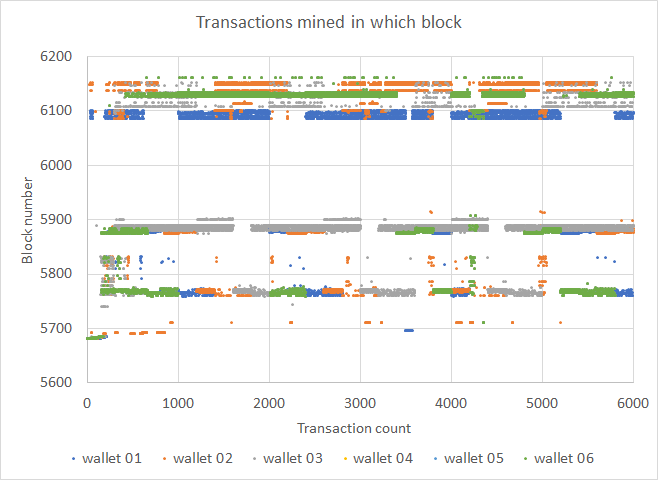
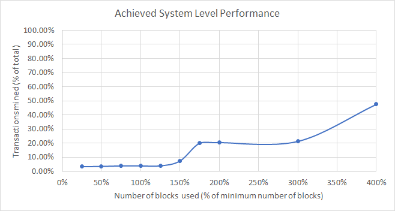

# Stress test of 2021/07/15

## Test summary

A total of 36,000 transactions were sent from 6 sending wallets to 10 receiver wallets. Attempted transaction spawning rate was evenly spaced over a duration of one hour; the fastest wallets completed the actual spawning in 1 hour and 10 minutes and the slowest in 1 hour and 41 minutes (1 hour and 25 minutes average for all wallets).

Transactions took a long time to be mined, but eventually, 99.806% of all negotiated transactions got mined.

We achieved a ***system-level performance factor of 3.86%***, indicating how close we came to the theoretical minimum amount of blocks possible to mine all transactions, which is not an outstanding achievement at all.

## Transaction mined density

Transaction mined density is shown below for all 6 wallets. The graph is a collection of points indicating which negotiated transaction was mined in which block. The transaction count is a time-based ordering of when transaction negotiation was completed. We would expect a continuous uniform distribution for optimal system-level performance.

The disjointed "bands" of blocks where transactions got mined is a concern at points to the fact that most transactions spent a long time in the mempool before being mined successfully.

## System-level performance

System-level performance is a measurement of the actual amount of transactions that were mined within the theoretical minimum amount of blocks that could be used to fit all 36,000 transactions in at a maximum of 650 transactions per block (56 blocks). 

The average system-level performance normalized to percentages is shown below. Best performance would be a linear relationship between transactions mined and the number of blocks used, i.e. 50% transactions would be mined in 50% blocks and so on until it levels of at 100%. The single point performance measurement would be at 100% blocks used, which is equal to 3.86%.

## Detail numbers

The *highest single txn send count* indicates that a lot of additional network traffic was generated.

| Sender wallet                        | wallet 01 | wallet 02 | wallet 03 | wallet 04 | wallet 05 | wallet 06 | Totals or Avg |
| ------------------------------------ | --------- | --------- | --------- | --------- | --------- | --------- | ------------- |
| Transactions submitted               | 6000      | 6000      | 6000      | 6000      | 6000      | 6000      | 36000         |
| Transactions negotiated              | 6000      | 6000      | 6000      | 6000      | 6000      | 6000      | 36000         |
| Submit start time (UTC) - 2021-07-15 | 16:14:14  | 16:14:33  | 16:14:50  | 16:15:00  | 16:15:00  | 16:15:00  | 16:14:46      |
| Submit end time (UTC) - 2021-07-15   | 17:55:12  | 17:30:18  | 17:24:45  | 17:43:04  | 17:43:04  | 17:43:04  | 17:39:55      |
| Submit time (min.)                   | 101       | 76        | 70        | 88        | 88        | 88        | 85            |
| Highest single txn send count        | 79        | 54        | 54        | 68        | 68        | 68        | 65            |
| End status: Pending                  | 0         | 0         | 0         | 0         | 0         | 0         | 0             |
| End status: Completed                | 0         | 0         | 0         | 0         | 0         | 0         | 0             |
| Cancelled                            | -         | -         | -         | -         | -         | -         | 0             |
| End status: Broadcast                | 21        | 0         | 4         | 23        | 0         | 0         | 48            |
| Invalidated                          | 0         | -         | 0         | 0         | -         | -         | 0             |
| End status: MinedUnconfirmed         | 0         | 6         | 3         | 0         | 1         | 0         | 10            |
| Invalidated                          | -         | 0         | 1         | -         | 0         | -         | 1             |
| End status: MinedConfirmed           | 5979      | 5994      | 5993      | 5977      | 5999      | 6000      | 35942         |
| Invalidated                          | 7         | 0         | 3         | 2         | 0         | 0         | 12            |
| MinedConfirmed & Valid               | 5972      | 5994      | 5990      | 5975      | 5999      | 6000      | 35930         |
| First mined block                    | 5681      | 5681      | 5681      | 5681      | 5681      | 5681      | 5681          |
| Final mined block                    | 6101      | 6153      | 6153      | 6162      | 6162      | 6162      | 6149          |
| Transactions mined in 14 blocks      | 173       | 382       | 153       | 158       | 158       | 158       | 197           |
| Transactions mined in 28 blocks      | 243       | 382       | 153       | 158       | 158       | 158       | 209           |
| Transactions mined in 42 blocks      | 243       | 512       | 153       | 161       | 161       | 161       | 232           |
| Transactions mined in 56  blocks     | 243       | 512       | 153       | 161       | 161       | 161       | 232           |
| Transactions mined in 70 blocks      | 243       | 512       | 162       | 161       | 161       | 161       | 233           |
| Transactions mined in 84 blocks      | 468       | 612       | 383       | 393       | 393       | 393       | 440           |
| Transactions mined in 98 blocks      | 1259      | 1220      | 1174      | 1182      | 1182      | 1182      | 1200          |
| Transactions mined in 112 blocks     | 1262      | 1264      | 1213      | 1200      | 1200      | 1200      | 1223          |
| Transactions mined in 168 blocks     | 1285      | 1382      | 1284      | 1239      | 1239      | 1239      | 1278          |
| Transactions mined in 224 blocks     | 2398      | 2569      | 5248      | 2315      | 2315      | 2315      | 2860          |
| System performance @ 14 blocks       | 2.88%     | 6.37%     | 2.55%     | 2.63%     | 2.63%     | 2.63%     | 3.28%         |
| System performance @ 28 blocks       | 4.05%     | 6.37%     | 2.55%     | 2.63%     | 2.63%     | 2.63%     | 3.48%         |
| System performance @ 42 blocks       | 4.05%     | 8.53%     | 2.55%     | 2.68%     | 2.68%     | 2.68%     | 3.86%         |
| System performance @ 56 blocks       | 4.05%     | 8.53%     | 2.55%     | 2.68%     | 2.68%     | 2.68%     | 3.86%         |
| System performance @ 70 blocks       | 4.05%     | 8.53%     | 2.70%     | 2.68%     | 2.68%     | 2.68%     | 3.89%         |
| System performance @ 84 blocks       | 7.80%     | 10.20%    | 6.38%     | 6.55%     | 6.55%     | 6.55%     | 7.34%         |
| System performance @ 98 blocks       | 20.98%    | 20.33%    | 19.57%    | 19.70%    | 19.70%    | 19.70%    | 20.00%        |
| System performance @ 112 blocks      | 21.03%    | 21.07%    | 20.22%    | 20.00%    | 20.00%    | 20.00%    | 20.39%        |
| System performance @ 168 blocks      | 21.42%    | 23.03%    | 21.40%    | 20.65%    | 20.65%    | 20.65%    | 21.30%        |
| System performance @ 224 blocks      | 39.97%    | 42.82%    | 87.47%    | 38.58%    | 38.58%    | 38.58%    | 47.67%        |
| Blocks to mine all                   | 421       | 473       | 473       | 482       | 482       | 482       | 469           |
| Mined success ratio (submitted)      | 99.533%   | 99.900%   | 99.833%   | 99.583%   | 99.983%   | 100.000%  | 99.806%       |
| Mined success ratio (negotiated)     | 99.533%   | 99.900%   | 99.833%   | 99.583%   | 99.983%   | 100.000%  | 99.806%       |
