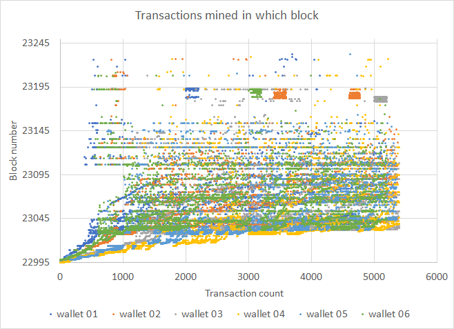
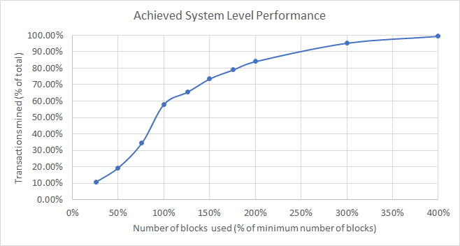

# Stress test of 2021/08/25

## Test summary

A total of 31,933 transactions were sent from 6 sending wallets to 10 receiver wallets. Attempted transaction spawning was evenly spaced over one hour; the fastest wallets completed the actual spawning in 1 hour and 50 minutes and the slowest in 2 hours and 17 minutes (2 hours and 6 minutes average for all wallets).

Mempool view of the network improved drastically due to sending validated transactions to all connected peers (testing PR #3239) instead of only to a select few. In the end, all monitored base nodes had an empty mempool, with all broadcast transactions mined without having to connect a miner to different base nodes afterwards. This stress test was therefore completed in a much shorter time than previous.

No banning of base nodes were observed due to relaxing the flood ban message count.

We achieved a ***system-level performance factor of 58.09%***, up from ***3.86%***, indicating how close we came to the theoretical minimum amount of blocks possible to mine all transactions.

## Transaction mined density

Transaction mined density is shown below for all 6 wallets. The graph is a collection of points indicating which negotiated transaction was mined in which block. The transaction count is a time-based ordering of when transaction negotiation was completed. We would expect a continuous uniform distribution for optimal system-level performance.

This metric showed a considerable improvement over the previous stress test.

## System-level performance

System-level performance is a measurement of the actual amount of transactions that were mined within the theoretical minimum amount of blocks that could be used to fit all 31,933 transactions in at a maximum of 650 transactions per block (50 blocks). 

The average system-level performance normalized to percentages is shown below. Best performance would be a linear relationship between transactions mined and the number of blocks used, i.e. 50% transactions would be mined in 50% blocks and so on until it levels of at 100%. The single point performance measurement would be at 100% blocks used, which is equal to 58.09%.

This metric showed a considerable improvement over the previous stress test.

## Detail numbers

All transactions that were not negotiated were only due to two of the receiving wallets not being contactable; one partially and the other during the entirety of the test.

The `76` transactions with end status `completed` and `cancelled` could have been rebroadcast to the network and would have been mined.

| Sender wallet                        | wallet 01 | wallet 02 | wallet 03 | wallet 04 | wallet 05 | wallet 06 | Totals or Avg |
| ------------------------------------ | --------- | --------- | --------- | --------- | --------- | --------- | ------------- |
| Transactions submitted               | 6000      | 6000      | 6000      | 6000      | 6000      | 6000      | 36000         |
| Transactions negotiated              | 5200      | 5375      | 5400      | 5400      | 5358      | 5200      | 31933         |
| Submit start time (UTC) - 2021-08-25 | 15:43:37  | 15:43:22  | 15:44:10  | 15:41:49  | 15:50:55  | 15:50:55  | 15:45:48      |
| Submit end time (UTC) - 2021-08-25   | 17:54:01  | 17:55:54  | 17:33:56  | 17:47:57  | 18:07:40  | 17:57:46  | 17:52:52      |
| Sumbit time (min.)                   | 130       | 133       | 110       | 126       | 137       | 122       | 126           |
| Highest single txn send count        | 2         | 1         | 1         | 4         | 15        | 3         | 4             |
| End status: Pending                  | 800       | 625       | 600       | 600       | 642       | 800       | 4067          |
| End status: Completed                | 0         | 0         | 76        | 0         | 0         | 0         | 76            |
| Cancelled                            | -         | -         | 76        | -         | -         | -         | 76            |
| End status: Broadcast                | 0         | 0         | 0         | 0         | 0         | 0         | 0             |
| Invalidated                          | -         | -         | -         | -         | -         | -         | 0             |
| End status: MinedUnconfirmed         | 0         | 0         | 0         | 0         | 0         | 0         | 0             |
| Invalidated                          | -         | -         | -         | -         | -         | -         | 0             |
| End status: MinedConfirmed           | 5200      | 5375      | 5324      | 5400      | 5358      | 5200      | 31857         |
| Invalidated                          | 0         | 0         | 0         | 0         | 0         | 0         | 0             |
| MinedConfirmed & Valid               | 5200      | 5375      | 5324      | 5400      | 5358      | 5200      | 31857         |
| First mined block                    | 22995     | 22995     | 22995     | 22995     | 22997     | 22998     | 22996         |
| Final mined block                    | 23232     | 23227     | 23208     | 23576     | 23463     | 23329     | 23339         |
| Transactions mined in 13 blocks      | 234       | 394       | 653       | 936       | 761       | 459       | 573           |
| Transactions mined in 25 blocks      | 459       | 717       | 1231      | 1890      | 1290      | 617       | 1034          |
| Transactions mined in 38 blocks      | 742       | 1134      | 2211      | 3258      | 2463      | 1286      | 1849          |
| Transactions mined in 50  blocks     | 2541      | 2745      | 3362      | 3957      | 3388      | 2591      | 3097          |
| Transactions mined in 63 blocks      | 3007      | 3068      | 3959      | 4192      | 3623      | 3096      | 3491          |
| Transactions mined in 75 blocks      | 3683      | 3538      | 4156      | 4376      | 3950      | 3778      | 3914          |
| Transactions mined in 88 blocks      | 4067      | 3927      | 4291      | 4559      | 4290      | 4106      | 4207          |
| Transactions mined in 100 blocks     | 4397      | 4331      | 4475      | 4686      | 4551      | 4402      | 4474          |
| Transactions mined in 150 blocks     | 4930      | 4938      | 4995      | 5275      | 5304      | 4975      | 5070          |
| Transactions mined in 200 blocks     | 5177      | 5351      | 5320      | 5371      | 5351      | 5190      | 5293          |
| System performance @ 13 blocks       | 4.50%     | 7.33%     | 12.09%    | 17.33%    | 14.20%    | 8.83%     | 10.71%        |
| System performance @ 25 blocks       | 8.83%     | 13.34%    | 22.80%    | 35.00%    | 24.08%    | 11.87%    | 19.32%        |
| System performance @ 38 blocks       | 14.27%    | 21.10%    | 40.94%    | 60.33%    | 45.97%    | 24.73%    | 34.56%        |
| System performance @ 50 blocks       | 48.87%    | 51.07%    | 62.26%    | 73.28%    | 63.23%    | 49.83%    | 58.09%        |
| System performance @ 63 blocks       | 57.83%    | 57.08%    | 73.31%    | 77.63%    | 67.62%    | 59.54%    | 65.50%        |
| System performance @ 75 blocks       | 70.83%    | 65.82%    | 76.96%    | 81.04%    | 73.72%    | 72.65%    | 73.50%        |
| System performance @ 88 blocks       | 78.21%    | 73.06%    | 79.46%    | 84.43%    | 80.07%    | 78.96%    | 79.03%        |
| System performance @ 100 blocks      | 84.56%    | 80.58%    | 82.87%    | 86.78%    | 84.94%    | 84.65%    | 84.06%        |
| System performance @ 150 blocks      | 94.81%    | 91.87%    | 92.50%    | 97.69%    | 98.99%    | 95.67%    | 95.25%        |
| System performance @ 200 blocks      | 99.56%    | 99.55%    | 98.52%    | 99.46%    | 99.87%    | 99.81%    | 99.46%        |
| Blocks to mine all                   | 238       | 233       | 214       | 582       | 467       | 332       | 344           |
| Mined success ratio (submitted)      | 86.667%   | 89.583%   | 88.733%   | 90.000%   | 89.300%   | 86.667%   | 88.492%       |
| Mined success ratio (negotiated)     | 100.000%  | 100.000%  | 98.593%   | 100.000%  | 100.000%  | 100.000%  | 99.762%       |

