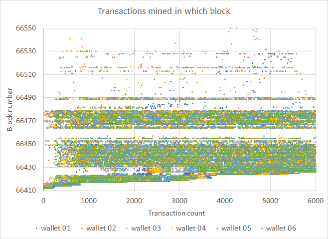

# Stress test of 2021/12/15

## Test summary

A total of 35,899 transactions were sent from 6 sending wallets to 10 receiver wallets. Transaction submission queueing rate was evenly spaced over a duration of one hour; the fastest wallets completed the actual submission in just over an hour and the slowest in 2 hours and 19 minutes (1.5 hours average for all wallets).

The test was a resounding success, albeit with a few challenges remaining. This time round we had a 100% mined success ratio across the board for submitted and negotiated transactions, up from 88.49% and 99.76% respectively. Due to improvements in the wallet code the submit time for 3 out of 6 wallets exactly matched the designed test submission time; previously this was doubled.

System level performance is a measurement of the actual amount of transactions that were mined within the theoretical minimum amount of blocks that could be used to fit all 35,899 transactions in at a maximum of 650 transactions per block (56 blocks). An average system level performance of 75.87% was achieved.

## Detail numbers

| Sender wallet                        | wallet 01 | wallet 02 | wallet 03 | wallet 04 | wallet 05 | wallet 06 | Totals or Avg |
| ------------------------------------ | --------- | --------- | --------- | --------- | --------- | --------- | ------------- |
| Transactions submitted               | 5899      | 6000      | 6000      | 6000      | 6000      | 6000      | 35899         |
| Transactions negotiated              | 5899      | 6000      | 6000      | 6000      | 6000      | 6000      | 35899         |
| Submit start time (UTC) - 2021-12-14 | 11:00:36  | 11:03:27  | 11:03:06  | 11:00:29  | 11:00:11  | 11:00:11  | 11:01:20      |
| Submit end time (UTC) - 2021-12-14   | 12:49:19  | 12:46:01  | 13:22:27  | 12:03:07  | 12:01:10  | 12:01:10  | 12:30:32      |
| Sumbit time (min.)                   | 109       | 103       | 139       | 63        | 61        | 61        | 89            |
| Highest single txn send count        | 3         | 4         | 6         | 3         | 3         | 3         | 22            |
| End status: Pending                  | 0         | 0         | 0         | 0         | 0         | 0         | 0             |
| End status: Completed                | 0         | 0         | 0         | 0         | 0         | 0         | 0             |
| Cancelled                            | -         | -         | -         | -         | -         | -         | 0             |
| End status: Broadcast                | 0         | 0         | 0         | 0         | 0         | 0         | 0             |
| Invalidated                          | -         | -         | -         | -         | -         | -         | 0             |
| End status: MinedUnconfirmed         | 0         | 0         | 0         | 0         | 0         | 0         | 0             |
| Invalidated                          | -         | -         | -         | -         | -         | -         | 0             |
| End status: MinedConfirmed           | 5899      | 6000      | 6000      | 6000      | 6000      | 6000      | 35899         |
| Invalidated                          | 0         | 0         | 0         | 0         | 0         | 0         | 0             |
| MinedConfirmed & Valid               | 5899      | 6000      | 6000      | 6000      | 6000      | 6000      | 35899         |
| First mined block                    | 66412     | 66414     | 66413     | 66412     | 66411     | 66412     | 66412         |
| Final mined block                    | 66938     | 67010     | 66567     | 66943     | 66490     | 66957     | 66938         |
| Transaction mined in 56 blocks       | 4440      | 4792      | 4555      | 4406      | 4539      | 4506      | 4540          |
| System performance @ 56 blocks       | 75.27%    | 79.87%    | 75.92%    | 73.43%    | 75.65%    | 75.10%    | 75.87%        |
| Blocks to mine all                   | 527       | 597       | 155       | 532       | 80        | 546       | 406           |
| Mined success ratio (submitted)      | 100.000%  | 100.000%  | 100.000%  | 100.000%  | 100.000%  | 100.000%  | 100.000%      |
| Mined success ratio (negotiated)     | 100.000%  | 100.000%  | 100.000%  | 100.000%  | 100.000%  | 100.000%  | 100.000%      |

## Transaction mined density

Transaction mined density is shown below for all 6 wallets.

