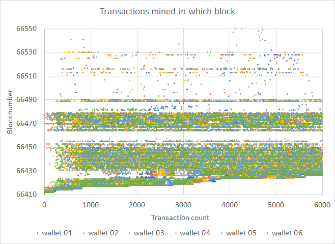
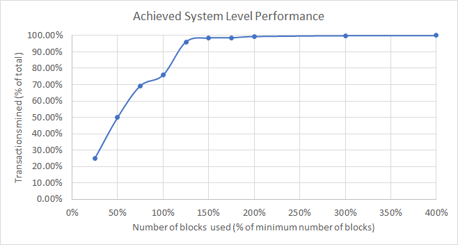

# Stress test of 2021/12/15

## Test summary

A total of 35,899 negotiated transactions were sent from 6 sending wallets to 10 receiver wallets, with attempted transactions spawning spaced evenly over one hour. The test was a resounding success, albeit with a few challenges remaining. This time around, we had a 99.98% and 100% mined success ratio for submitted and negotiated transactions, up from 88.49% and 99.76%, respectively.  

Due to improvements in the wallet code, the actual transaction spawning rate for 3 out of 6 wallets exactly matched the test design spawning rate; previously, it took twice as long. The fastest wallets completed the actual transaction spawning in just over an hour and the slowest in 2 hours and 19 minutes (1 hour and 29 minutes average for all wallets).

We achieved a ***system-level performance factor of 75.87%***, indicating how close we came to the theoretical minimum amount of blocks possible to mine all transactions.

Some of the adverse symptoms observed during the stress test had to do with reorgs close to the tip where header sync and block sync for following base nodes would become disjointed; blocks were streamed for previously synced headers that do not exist anymore. Other symptoms highlighted mempools not being in sync, especially for base nodes attached to miners and connectivity issues between base nodes and wallets.

## Transaction mined density

Transaction mined density is shown below for all 6 wallets. The graph is a collection of points indicating which negotiated transaction was mined in which block. The transaction count is a time-based ordering of when transaction negotiation was completed. We would expect a continuous uniform distribution for optimal system-level performance.

## System-level performance

System-level performance is a measurement of the actual amount of transactions that were mined within the theoretical minimum amount of blocks that could be used to fit all 35,899 transactions in at a maximum of 650 transactions per block (56 blocks). 

The average system-level performance normalized to percentages is shown below. Best performance would be a linear relationship between transactions mined and the number of blocks used, i.e. 50% transactions would be mined in 50% blocks and so on until it levels of at 100%. The single point performance measurement would be at 100% blocks used, which is equal to 75.87%.

## Detail numbers

**Note:** A finger fault in executing the test script for _wallet 01_ reduced the number of transactions submitted for the test from 6,000 to 5,899 and resulted in 6 pending transactions.

| Sender wallet                        | wallet 01 | wallet 02 | wallet 03 | wallet 04 | wallet 05 | wallet 06 | Totals or Avg |
| ------------------------------------ | --------- | --------- | --------- | --------- | --------- | --------- | ------------- |
| Transactions submitted               | 5899      | 6000      | 6000      | 6000      | 6000      | 6000      | 35899         |
| Transactions negotiated              | 5893      | 6000      | 6000      | 6000      | 6000      | 6000      | 35893         |
| Submit start time (UTC) - 2021-12-14 | 11:00:36  | 11:03:27  | 11:03:06  | 11:00:29  | 11:00:11  | 11:00:11  | 11:01:20      |
| Submit end time (UTC) - 2021-12-14   | 12:49:19  | 12:46:01  | 13:22:27  | 12:03:07  | 12:01:10  | 12:01:09  | 12:30:32      |
| Submit time (min.)                   | 109       | 103       | 139       | 63        | 61        | 61        | 89            |
| Highest single txn send count        | 3         | 4         | 6         | 3         | 3         | 3         | 4             |
| End status: Pending                  | 6         | 0         | 0         | 0         | 0         | 0         | 6             |
| End status: Completed                | 0         | 0         | 0         | 0         | 0         | 0         | 0             |
| Cancelled                            | -         | -         | -         | -         | -         | -         | 0             |
| End status: Broadcast                | 0         | 0         | 0         | 0         | 0         | 0         | 0             |
| Invalidated                          | -         | -         | -         | -         | -         | -         | 0             |
| End status: MinedUnconfirmed         | 0         | 0         | 0         | 0         | 0         | 0         | 0             |
| Invalidated                          | -         | -         | -         | -         | -         | -         | 0             |
| End status: MinedConfirmed           | 5893      | 6000      | 6000      | 6000      | 6000      | 6000      | 35893         |
| Invalidated                          | 0         | 0         | 0         | 0         | 0         | 0         | 0             |
| MinedConfirmed & Valid               | 5893      | 6000      | 6000      | 6000      | 6000      | 6000      | 35893         |
| First mined block                    | 66412     | 66414     | 66413     | 66412     | 66411     | 66412     | 66412         |
| Final mined block                    | 66633     | 67010     | 66567     | 66943     | 66490     | 66957     | 66767         |
| Transactions mined in 14 blocks      | 1540      | 1721      | 1302      | 1443      | 1422      | 1457      | 1481          |
| Transactions mined in 28 blocks      | 2979      | 3255      | 2945      | 2855      | 2890      | 2984      | 2985          |
| Transactions mined in 42 blocks      | 4116      | 4253      | 4085      | 4070      | 4207      | 4143      | 4146          |
| Transactions mined in 56  blocks     | 4440      | 4792      | 4555      | 4406      | 4539      | 4506      | 4540          |
| Transactions mined in 70 blocks      | 5666      | 5731      | 5651      | 5790      | 5797      | 5875      | 5752          |
| Transactions mined in 84 blocks      | 5796      | 5869      | 5827      | 5937      | 6000      | 5958      | 5898          |
| Transactions mined in 98 blocks      | 5806      | 5874      | 5835      | 5945      | 6000      | 5963      | 5904          |
| Transactions mined in 112 blocks     | 5857      | 5954      | 5925      | 5971      | 6000      | 5985      | 5949          |
| Transactions mined in 168 blocks     | 5891      | 5999      | 6000      | 5990      | 6000      | 5991      | 5979          |
| Transactions mined in 224 blocks     | 5893      | 5999      | 6000      | 5997      | 6000      | 5997      | 5981          |
| System performance @ 14 blocks       | 26.13%    | 28.68%    | 21.70%    | 24.05%    | 23.70%    | 24.28%    | 24.76%        |
| System performance @ 28 blocks       | 50.55%    | 54.25%    | 49.08%    | 47.58%    | 48.17%    | 49.73%    | 49.89%        |
| System performance @ 42 blocks       | 69.85%    | 70.88%    | 68.08%    | 67.83%    | 70.12%    | 69.05%    | 69.30%        |
| System performance @ 56 blocks       | 75.34%    | 79.87%    | 75.92%    | 73.43%    | 75.65%    | 75.10%    | 75.89%        |
| System performance @ 70 blocks       | 96.15%    | 95.52%    | 94.18%    | 96.50%    | 96.62%    | 97.92%    | 96.15%        |
| System performance @ 84 blocks       | 98.35%    | 97.82%    | 97.12%    | 98.95%    | 100.00%   | 99.30%    | 98.59%        |
| System performance @ 98 blocks       | 98.52%    | 97.90%    | 97.25%    | 99.08%    | 100.00%   | 99.38%    | 98.69%        |
| System performance @ 112 blocks      | 99.39%    | 99.23%    | 98.75%    | 99.52%    | 100.00%   | 99.75%    | 99.44%        |
| System performance @ 168 blocks      | 99.97%    | 99.98%    | 100.00%   | 99.83%    | 100.00%   | 99.85%    | 99.94%        |
| System performance @ 224 blocks      | 100.00%   | 99.98%    | 100.00%   | 99.95%    | 100.00%   | 99.95%    | 99.98%        |
| Blocks to mine all                   | 222       | 597       | 155       | 532       | 80        | 546       | 355           |
| Mined success ratio (submitted)      | 99.898%   | 100.000%  | 100.000%  | 100.000%  | 100.000%  | 100.000%  | 99.983%       |
| Mined success ratio (negotiated)     | 100.000%  | 100.000%  | 100.000%  | 100.000%  | 100.000%  | 100.000%  | 100.000%      |

