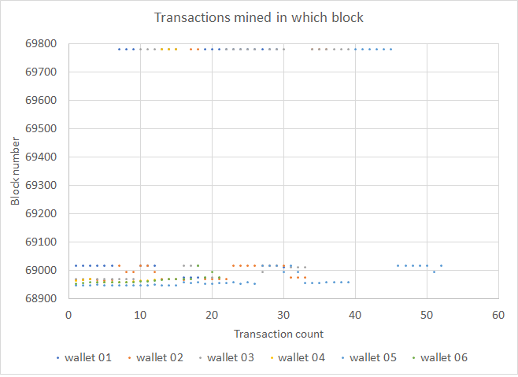
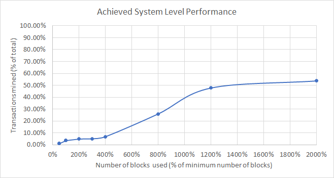

# Stress test of 2021/12/21 (Console to Mobile wallets)

## Test summary

A total of 193 negotiated transactions were sent from 6 sending **console wallets** to 8 receiver **mobile wallets**, with attempted transactions spawning at a slow rate and spaced evenly over 6.5 minutes.

The test was not very successful in terms of outright system performance. Approximately 55% of all submitted-for-negotiation transactions were abandoned due to connectivity and/or discovery issues whereas the rest were all mined. Theoretically all negotiated transactions should have been mined within two blocks, but we only achieved a ***system-level performance factor of 3.53%***. The bulk of the transactions were mined within 71 blocks, but ~26% of the transactions spent a long time in the mempool and were only mined in the 837th block.

The adverse connectivity and/or discovery symptoms observed during the stress test where ~55% transactions were abandoned all shared the following sequence of events:

- attempt to send transaction to peer;
- failed to connect to peer;
- attempting to connect to base node peer;
- transaction send to neighbours for store and forward timed out;
- empty message received waiting for discovery to complete;
- failed to send transaction both directly or via store and forward;
- pending transaction cancelled.

 Some transactions also spent ~750 blocks in the mempool before being mined.

## Transaction mined density

Transaction mined density is shown below for all 6 wallets. The graph is a collection of points indicating which negotiated transaction was mined in which block. The transaction count is a time-based ordering of when transaction negotiation was completed. We would expect a continuous uniform distribution for optimal system-level performance.

## System-level performance

System-level performance is a measurement of the actual amount of transactions that were mined within the theoretical minimum amount of blocks that could be used to fit all 193 transactions in at a maximum of 650 transactions per block *also considering the time frame from first to final transaction negotiation to start* (2 blocks). 

The average system-level performance normalized to percentages is shown below. Best performance would be a linear relationship between transactions mined and the number of blocks used, i.e. 50% transactions would be mined in 50% blocks and so on until it levels of at 100%. The single point performance measurement would be at 100% blocks used, which is equal to 3.53%.

## Detail numbers

**Note:** The 239 pending transactions in this case are the submitted but not negotiated transactions.

| Sender wallet                        | wallet 01 | wallet 02 | wallet 03 | wallet 04 | wallet 05 | wallet 06 | Totals or Avg |
| ------------------------------------ | --------- | --------- | --------- | --------- | --------- | --------- | ------------- |
| Transactions submitted               | 72        | 72        | 72        | 72        | 72        | 72        | 432           |
| Transactions negotiated              | 30        | 36        | 39        | 15        | 52        | 21        | 193           |
| Submit start time (UTC) - 2021-12-21 | 10:48:11  | 10:48:14  | 10:48:12  | 10:49:11  | 10:46:25  | 10:46:25  | 10:47:46      |
| Submit end time (UTC) - 2021-12-21   | 12:45:00  | 12:44:57  | 12:04:52  | 10:51:43  | 11:01:46  | 10:51:24  | 11:43:17      |
| Submit time (min.)                   | 117       | 117       | 77        | 2         | 15        | 3         | 55            |
| Highest single txn send count        | 2         | 1         | 3         | 1         | 2         | 1         | 2             |
| End status: Pending                  | 42        | 36        | 33        | 57        | 20        | 51        | 239           |
| End status: Completed                | 0         | 0         | 0         | 0         | 0         | 0         | 0             |
| Cancelled                            | -         | -         | -         | -         | -         | -         | 0             |
| End status: Broadcast                | 0         | 0         | 0         | 0         | 0         | 0         | 0             |
| Invalidated                          | -         | -         | -         | -         | -         | -         | 0             |
| End status: MinedUnconfirmed         | 0         | 0         | 0         | 0         | 0         | 0         | 0             |
| Invalidated                          | -         | -         | -         | -         | -         | -         | 0             |
| End status: MinedConfirmed           | 30        | 36        | 39        | 15        | 52        | 21        | 193           |
| Invalidated                          | 0         | 0         | 0         | 0         | 0         | 0         | 0             |
| MinedConfirmed & Valid               | 30        | 36        | 39        | 15        | 52        | 21        | 193           |
| First mined block                    | 68976     | 68965     | 68970     | 68960     | 68947     | 68953     | 68962         |
| Final mined block                    | 69783     | 69783     | 69783     | 69783     | 69783     | 69017     | 69655         |
| Transactions mined in 1 blocks       | 0         | 0         | 0         | 0         | 3         | 0         | 1             |
| Transactions mined in 1 blocks       | 0         | 0         | 0         | 0         | 3         | 0         | 1             |
| Transactions mined in 2 blocks       | 0         | 0         | 0         | 0         | 11        | 0         | 2             |
| Transactions mined in 2 blocks       | 0         | 0         | 0         | 0         | 11        | 0         | 2             |
| Transactions mined in 4 blocks       | 0         | 0         | 0         | 0         | 15        | 0         | 3             |
| Transactions mined in 6 blocks       | 0         | 0         | 0         | 0         | 16        | 0         | 3             |
| Transactions mined in 8 blocks       | 0         | 0         | 0         | 0         | 19        | 1         | 3             |
| Transactions mined in 16 blocks      | 0         | 0         | 0         | 6         | 33        | 11        | 8             |
| Transactions mined in 24 blocks      | 0         | 14        | 9         | 12        | 33        | 17        | 14            |
| Transactions mined in 40 blocks      | 3         | 17        | 12        | 12        | 33        | 19        | 16            |
| System performance @ 1 blocks        | 0.00%     | 0.00%     | 0.00%     | 0.00%     | 5.77%     | 0.00%     | 0.96%         |
| System performance @ 1 blocks        | 0.00%     | 0.00%     | 0.00%     | 0.00%     | 5.77%     | 0.00%     | 0.96%         |
| System performance @ 2 blocks        | 0.00%     | 0.00%     | 0.00%     | 0.00%     | 21.15%    | 0.00%     | 3.53%         |
| System performance @ 2 blocks        | 0.00%     | 0.00%     | 0.00%     | 0.00%     | 21.15%    | 0.00%     | 3.53%         |
| System performance @ 4 blocks        | 0.00%     | 0.00%     | 0.00%     | 0.00%     | 28.85%    | 0.00%     | 4.81%         |
| System performance @ 6 blocks        | 0.00%     | 0.00%     | 0.00%     | 0.00%     | 30.77%    | 0.00%     | 5.13%         |
| System performance @ 8 blocks        | 0.00%     | 0.00%     | 0.00%     | 0.00%     | 36.54%    | 4.76%     | 6.88%         |
| System performance @ 16 blocks       | 0.00%     | 0.00%     | 0.00%     | 40.00%    | 63.46%    | 52.38%    | 25.97%        |
| System performance @ 24 blocks       | 0.00%     | 38.89%    | 23.08%    | 80.00%    | 63.46%    | 80.95%    | 47.73%        |
| System performance @ 40 blocks       | 10.00%    | 47.22%    | 30.77%    | 80.00%    | 63.46%    | 90.48%    | 53.65%        |
| Blocks to mine all                   | 837       | 837       | 837       | 837       | 837       | 71        | 709           |
| Mined success ratio (submitted)      | 41.667%   | 50.000%   | 54.167%   | 20.833%   | 72.222%   | 29.167%   | 44.676%       |
| Mined success ratio (negotiated)     | 100.000%  | 100.000%  | 100.000%  | 100.000%  | 100.000%  | 100.000%  | 100.000%      |
